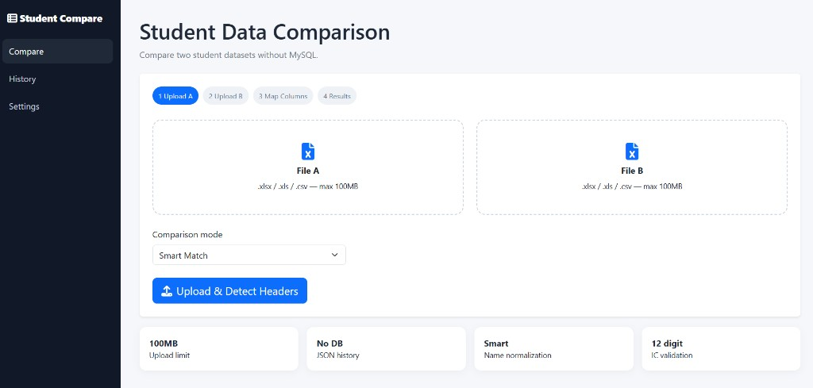
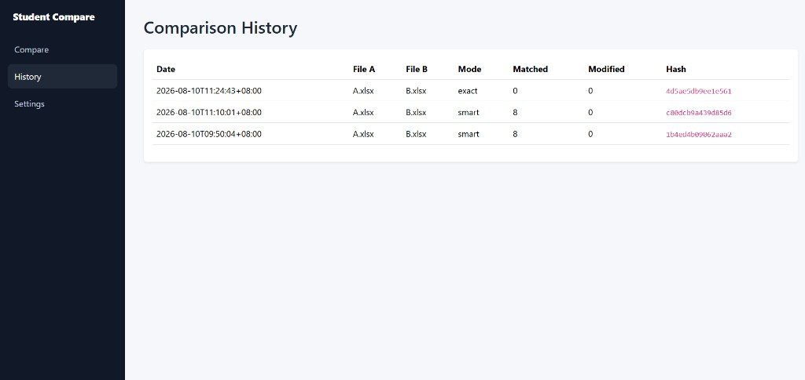
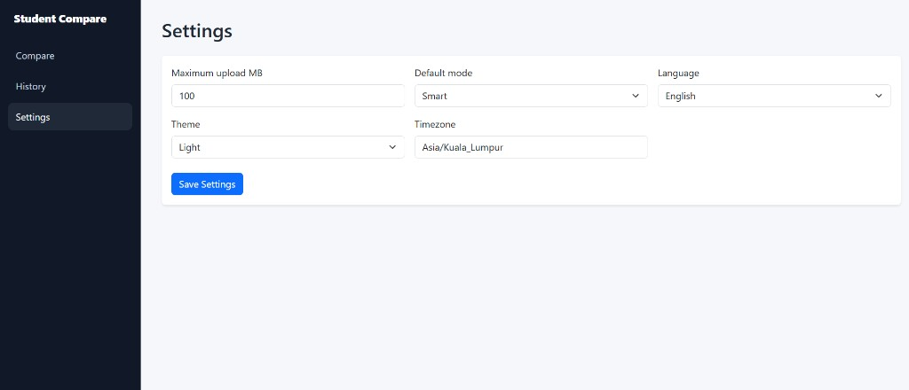

# Student Data Comparison System — No Database

A PHP 8.2+ student Excel/CSV comparison app that does **not use MySQL**. History and settings are stored as JSON files.

This project is released for **educational and non-commercial use** only. See [LICENSE](LICENSE).

## Screenshots

<table>
  <tr>
    <td align="center" width="50%"><br/><sub>Compare</sub></td>
    <td align="center" width="50%"><br/><sub>History</sub></td>
  </tr>
  <tr>
    <td align="center" width="50%"><br/><sub>Settings</sub></td>
    <td></td>
  </tr>
</table>

## Install

1. Put this folder in `C:\xampp\htdocs\student-data-comparison-system`.
2. Enable PHP extensions: `gd`, `zip`, `mbstring`, `fileinfo`.
3. In the project folder run `composer install`.
4. Open `http://localhost/student-data-comparison-system/`.

## Recommended php.ini for 100MB uploads

```ini
upload_max_filesize = 100M
post_max_size = 210M
max_execution_time = 300
memory_limit = 512M
```

Restart Apache after editing php.ini.

## Workflow

Upload File A and File B → automatic header detection → select common comparison fields → Smart/Exact matching → dashboard → DataTables → Excel/CSV/Print.

## Supported

`.xlsx`, `.xls`, `.csv` up to 100MB.

Smart Match ignores case, repeated/leading/trailing spaces and punctuation/symbols. IC numbers are normalized to digits, so `010101015555`, `010101-01-5555` and `010101 01 5555` compare equally.

## No database

There is no `Database.php`, no PDO connection and no SQL requirement. Comparison history is saved under `data/history/` and settings under `data/settings.json`.

## Large files

Row reading uses PhpSpreadsheet row filters in 5,000-row chunks. Matching indexes are kept in PHP memory, so 100,000+ rows may require a higher `memory_limit` depending on column count.

## License

[Educational Use License](LICENSE) — for learning, teaching, and coursework only. Not for commercial use.
